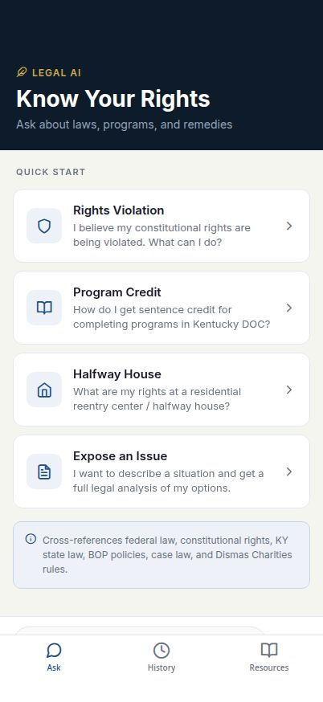

# ReEntry Legal AI



A mobile AI assistant that helps people in reentry programs understand their legal rights, cross-reference applicable laws, and find available remedies.

The AI has deep knowledge of Kentucky DOC program catalogs, BOP reentry guidelines, Dismas Charities rules, constitutional rights, federal law (First Step Act, § 3624), KY state law (KRS 197.045, 439.345), BOP policies (PS 5140.40, RDAP), and key case law. Every response is structured as: **Direct Answer → Legal Framework → Available Remedies → Legal Arguments → Case Law**.

---

## Features

- **Ask** — Type any legal question or describe a situation and get a full legal analysis
- **Quick prompts** — Rights violations, program credit, halfway house rights, expose an issue
- **Chat** — Multi-turn conversations with streamed AI responses (token-by-token via SSE)
- **History** — Browse and resume past conversations
- **Resources** — Quick-reference guide to constitutional rights, federal/KY law, BOP policies, DOC programs, key case law, and reentry remedies

---

## Stack

| Layer | Technology |
|---|---|
| Mobile | Expo SDK 54 (React Native, web-compatible) |
| API | Express 5, Node.js 24 |
| Database | PostgreSQL + Drizzle ORM |
| AI | OpenAI `gpt-5.4` via **Replit AI Integrations** proxy |
| Validation | Zod (`zod/v4`), `drizzle-zod` |
| API contract | OpenAPI spec → Orval codegen (typed hooks + Zod schemas) |
| Build | esbuild (CJS bundle), TypeScript 5.9 |
| Package manager | pnpm workspaces |

> **AI integration note:** This project uses [Replit AI Integrations](https://docs.replit.com/ai/integrations) for OpenAI access. The credentials (`AI_INTEGRATIONS_OPENAI_API_KEY` and `AI_INTEGRATIONS_OPENAI_BASE_URL`) are provisioned automatically when the integration is enabled — no manual API key management required.

---

## Project Structure

```
artifacts/
  mobile/               # Expo mobile app
    app/(tabs)/
      index.tsx         # "Ask" tab: quick-start prompts + free-text input
      history.tsx       # Conversation history list
      resources.tsx     # Expandable legal reference guide
    app/chat/[id].tsx   # Chat screen with SSE streaming
    constants/colors.ts # Navy/gold legal theme (light + dark)
    hooks/useConversations.ts
  api-server/           # Express API
    src/routes/openai/  # Conversation + streaming endpoints

lib/
  db/src/schema/        # conversations.ts + messages.ts (Drizzle schema)
  api-spec/openapi.yaml # OpenAPI contract (source of truth)
  api-zod/              # Generated Zod schemas
  api-client-react/     # Generated React Query hooks
```

---

## Setup

### Prerequisites

- [Node.js 24](https://nodejs.org/)
- [pnpm](https://pnpm.io/) (`npm install -g pnpm`)
- A PostgreSQL database

### Environment variables

| Variable | Description |
|---|---|
| `DATABASE_URL` | PostgreSQL connection string |
| `AI_INTEGRATIONS_OPENAI_API_KEY` | Auto-provisioned via Replit AI Integrations |
| `AI_INTEGRATIONS_OPENAI_BASE_URL` | Auto-provisioned via Replit AI Integrations |

If running outside of Replit, set `AI_INTEGRATIONS_OPENAI_API_KEY` to a standard OpenAI API key and `AI_INTEGRATIONS_OPENAI_BASE_URL` to `https://api.openai.com/v1`.

### Install and run

```bash
# Install dependencies
pnpm install

# Push database schema (dev only)
pnpm --filter @workspace/db run push

# Start the API server (port 5000)
pnpm --filter @workspace/api-server run dev

# Start the mobile app (in a separate terminal)
pnpm --filter @workspace/mobile run dev
```

### Other useful commands

```bash
# Full typecheck across all packages
pnpm run typecheck

# Build all packages
pnpm run build

# Regenerate API hooks and Zod schemas from the OpenAPI spec
pnpm --filter @workspace/api-spec run codegen
```

---

## CI/CD Setup

The project ships with a GitHub Actions workflow (`.github/workflows/ci.yml`) that runs typecheck and lint on every pull request, then triggers a Replit deployment on every push to `main`.

The deploy step calls the Replit deployment API and requires two **GitHub repository secrets** to be set before it will succeed.

### Required secrets

| Secret | What it is | Where to find it |
|---|---|---|
| `REPLIT_TOKEN` | A personal API token that authenticates requests to the Replit API on your behalf | Replit → Account settings → **API tokens** → Generate a new token |
| `REPLIT_REPL_ID` | The unique ID of the Replit project (repl) to deploy | Open the repl in Replit, then go to **Settings** → the ID is shown under "Repl ID", or extract it from the repl's URL: `https://replit.com/@<user>/<slug>` — the ID is also visible in the Replit API response for your repls |

### How to add them

1. Open your GitHub repository.
2. Go to **Settings → Secrets and variables → Actions**.
3. Click **New repository secret** for each of the two secrets above.
4. Paste the value and save.

Once both secrets are in place, any push to `main` that passes typecheck and lint will automatically trigger a deployment on Replit.

---

## Architecture

- **Contract-first API**: The OpenAPI spec (`lib/api-spec/openapi.yaml`) is the source of truth. Orval generates typed React Query hooks and Zod validators used on both client and server.
- **SSE streaming**: AI responses stream token-by-token via Server-Sent Events. The mobile app uses `expo/fetch` to handle streaming.
- **Conversation persistence**: All messages are stored in PostgreSQL and sent back to the AI each turn for context continuity.
- **Auto-title**: New conversations are automatically titled from the first message's leading words.

---

## Contributing

See [CONTRIBUTING.md](CONTRIBUTING.md) for how to fork, branch, run the project locally, and open a pull request.
